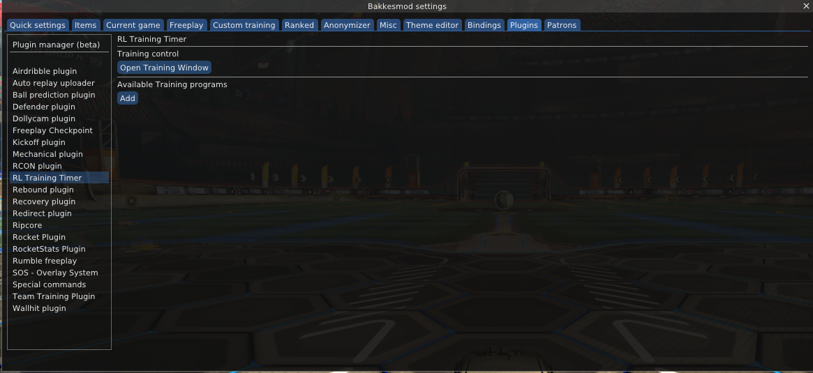
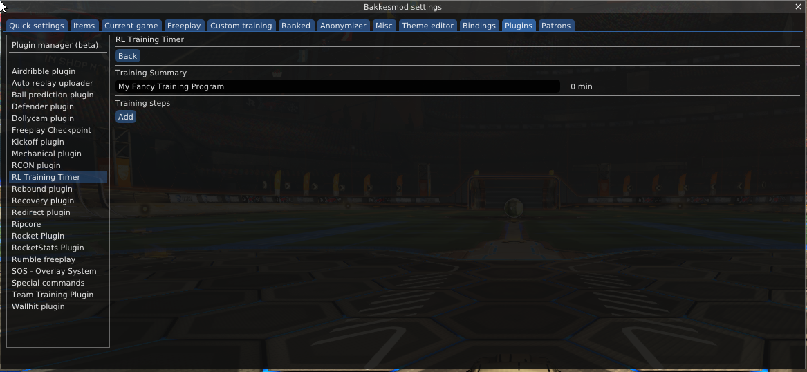
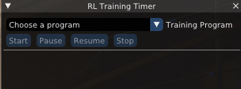

# RL Training Timer (Bakkesmod Plugin for Rocket League)

## How to beta test:
1) Go to https://github.com/Timmeey86/RLTrainingTimer/releases and download just the `RLTrainingTimer.dll` from the newest tag. 
2) Open your Windows Explorer at `%APPDATA%\bakkesmod\bakkesmod\plugins` and put the `RLTrainingTimer.dll` in there
3) Open Rocket League, press `F2`, go to `Plugins` tab, go to `Plugin manager (beta)`, click `Open pluginmanager`, then set the check box next to `RLTrainingTimer`
4) Close the `Plugin manager` window and click on `RL Training Timer` in the plugins list in the `Bakkesmod settings` window
5) At this point, you should see something like this:

6) Click the `Add` button to add a training program, enter a name in the empty bar, then click on `Edit`
7) You should see something like this:

8) For each training step you want to do in the training, click `Add`, change the name, enter a duration in minutes (or press the + button several times) for this step.
9) If you decide otherwise, you can move the training steps up or down with the arrow buttons, and you can also delete them.
10) Click the `Back` button on top and click `Open Training Window`, then close the `Bakkesmod settings window`.
11) You should see something like this: 

12) Load into freeplay (you could also load into custom training, a private game or any other mode really)
13) Select your program through the `Choose a program` box, then click `Start`
14) Enjoy your training 😉
